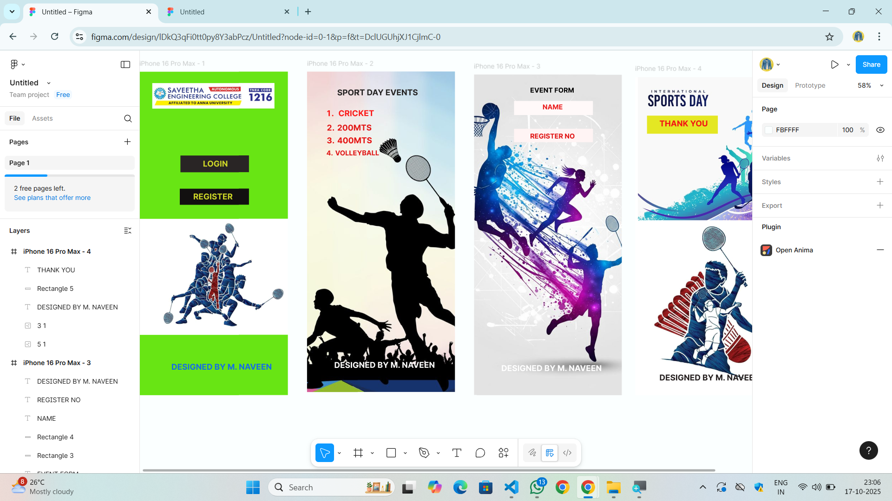

# Ex09 Event Registration Web Application
## Date:17.10.2025

## AIM:
To design, develop and deploy a web application for event registration.

## DESIGN STEPS:

### Step 1:
Create a new frame.

### Step 2:
Select any one preset size of your choice.

### Step 3:
Select the shapes you need.

### Step 4:
Import images as needed.

### Step 5:
Create pages based on your need and link them.

### Step 6:

Validate the HTML and CSS code.

### Step 6:

Publish the website in the given URL.

## DESIGN TOOL:
Figma

## CODE:
~~~
PAGE 1
index.html
<!DOCTYPE html>
<html>
  <head>
    <meta name="viewport" content="width=device-width, initial-scale=1" />
    <meta charset="utf-8" />
    <link rel="stylesheet" href="globals.css" />
    <link rel="stylesheet" href="style.css" />
  </head>
  <body>
    

      

      

      
LOGIN

      
REGISTER

      
      
DESIGNED BY M. NAVEEN

    

  </body>
</html>
global.css

@import url("https://cdnjs.cloudflare.com/ajax/libs/meyer-reset/2.0/reset.min.css");
* {
  -webkit-font-smoothing: antialiased;
  box-sizing: border-box;
}
html,
body {
  margin: 0px;
  height: 100%;
}
/* a blue color as a generic focus style */
button:focus-visible {
  outline: 2px solid #4a90e2 !important;
  outline: -webkit-focus-ring-color auto 5px !important;
}
a {
  text-decoration: none;
}

style.css

.iphone-pro-max {
  background-color: #67e514;
  width: 100%;
  min-width: 443px;
  min-height: 965px;
  position: relative;
}

.iphone-pro-max .rectangle {
  position: absolute;
  top: 250px;
  left: 123px;
  width: 204px;
  height: 50px;
  background-color: #292525;
}

.iphone-pro-max .div {
  position: absolute;
  top: 349px;
  left: 121px;
  width: 206px;
  height: 48px;
  background-color: #110f0f;
}

.iphone-pro-max .text-wrapper {
  position: absolute;
  top: 260px;
  left: 190px;
  width: 205px;
  font-family: "Inter-Bold", Helvetica;
  font-weight: 700;
  color: #cdd626;
  font-size: 24px;
  letter-spacing: 0;
  line-height: normal;
}

.iphone-pro-max .text-wrapper-2 {
  position: absolute;
  top: 358px;
  left: 161px;
  font-family: "Inter-Bold", Helvetica;
  font-weight: 700;
  color: #cdd626;
  font-size: 24px;
  letter-spacing: 0;
  line-height: normal;
}

.iphone-pro-max .element {
  position: absolute;
  top: 439px;
  left: 0;
  width: 443px;
  height: 346px;
  aspect-ratio: 1.28;
  object-fit: cover;
}

.iphone-pro-max .text-wrapper-3 {
  position: absolute;
  top: 866px;
  left: 96px;
  width: 341px;
  font-family: "Inter-Bold", Helvetica;
  font-weight: 700;
  color: #146ee4;
  font-size: 24px;
  letter-spacing: 0;
  line-height: normal;
}

PAGE 2
index.html

<!DOCTYPE html>
<html>
  <head>
    <meta name="viewport" content="width=device-width, initial-scale=1" />
    <meta charset="utf-8" />
    <link rel="stylesheet" href="globals.css" />
    <link rel="stylesheet" href="style.css" />
  </head>
  <body>
    

      
      
SPORT DAY EVENTS

      
CRICKET

      
200MTS

      
400MTS

      
VOLLEYBALL

      
DESIGNED BY M. NAVEEN

    

  </body>
</html>

globals.css

@import url("https://cdnjs.cloudflare.com/ajax/libs/meyer-reset/2.0/reset.min.css");
* {
  -webkit-font-smoothing: antialiased;
  box-sizing: border-box;
}
html,
body {
  margin: 0px;
  height: 100%;
}
/* a blue color as a generic focus style */
button:focus-visible {
  outline: 2px solid #4a90e2 !important;
  outline: -webkit-focus-ring-color auto 5px !important;
}
a {
  text-decoration: none;
}

style.css

.iphone-pro-max {
  background-color: #ffffff;
  width: 100%;
  min-width: 440px;
  min-height: 956px;
  position: relative;
}

.iphone-pro-max .element {
  position: absolute;
  top: 0;
  left: 0;
  width: 440px;
  height: 956px;
  aspect-ratio: 0.67;
  object-fit: cover;
}

.iphone-pro-max .text-wrapper {
  position: absolute;
  top: 48px;
  left: 90px;
  width: 260px;
  font-family: "Inter-Bold", Helvetica;
  font-weight: 700;
  color: #252323;
  font-size: 24px;
  letter-spacing: 0;
  line-height: normal;
}

.iphone-pro-max .CRICKET {
  position: absolute;
  top: 110px;
  left: 52px;
  width: 218px;
  font-family: "Inter-Bold", Helvetica;
  font-weight: 700;
  color: #fc1919;
  font-size: 24px;
  letter-spacing: 0;
  line-height: normal;
}

.iphone-pro-max .div {
  position: absolute;
  top: 153px;
  left: 54px;
  width: 202px;
  font-family: "Inter-Bold", Helvetica;
  font-weight: 700;
  color: #e11818;
  font-size: 24px;
  letter-spacing: 0;
  line-height: normal;
}

.iphone-pro-max .text-wrapper-2 {
  position: absolute;
  top: 191px;
  left: 54px;
  width: 153px;
  font-family: "Inter-Bold", Helvetica;
  font-weight: 700;
  color: #e51212;
  font-size: 24px;
  letter-spacing: 0;
  line-height: normal;
}

.iphone-pro-max .text-wrapper-3 {
  position: absolute;
  top: 231px;
  left: 54px;
  width: 175px;
  font-family: "Inter-Bold", Helvetica;
  font-weight: 700;
  color: #df1616;
  font-size: 20px;
  letter-spacing: 0;
  line-height: normal;
}

.iphone-pro-max .text-wrapper-4 {
  position: absolute;
  top: 861px;
  left: 81px;
  width: 325px;
  font-family: "Inter-Bold", Helvetica;
  font-weight: 700;
  color: #ffffff;
  font-size: 24px;
  letter-spacing: 0;
  line-height: normal;
}

PAGE 3

index.html

<!DOCTYPE html>
<html>
  <head>
    <meta name="viewport" content="width=device-width, initial-scale=1" />
    <meta charset="utf-8" />
    <link rel="stylesheet" href="globals.css" />
    <link rel="stylesheet" href="style.css" />
  </head>
  <body>
    

      
      
EVENT FORM

      

      

      
NAME

      
REGISTER NO

      
DESIGNED BY M. NAVEEN

    

  </body>
</html>

globals.css

@import url("https://cdnjs.cloudflare.com/ajax/libs/meyer-reset/2.0/reset.min.css");
* {
  -webkit-font-smoothing: antialiased;
  box-sizing: border-box;
}
html,
body {
  margin: 0px;
  height: 100%;
}
/* a blue color as a generic focus style */
button:focus-visible {
  outline: 2px solid #4a90e2 !important;
  outline: -webkit-focus-ring-color auto 5px !important;
}
a {
  text-decoration: none;
}

style.css

.iphone-pro-max {
  background-color: #ffffff;
  overflow: hidden;
  width: 100%;
  min-width: 440px;
  min-height: 956px;
  position: relative;
}

.iphone-pro-max .element {
  position: absolute;
  top: 0;
  left: 0;
  width: 440px;
  height: 956px;
  aspect-ratio: 0.7;
  object-fit: cover;
}

.iphone-pro-max .text-wrapper {
  position: absolute;
  top: 35px;
  left: 167px;
  width: 291px;
  font-family: "Inter-Bold", Helvetica;
  font-weight: 700;
  color: #000000;
  font-size: 20px;
  letter-spacing: 0;
  line-height: normal;
}

.iphone-pro-max .rectangle {
  top: 79px;
  height: 42px;
  background-color: #fff9f9;
  position: absolute;
  left: 119px;
  width: 235px;
}

.iphone-pro-max .div {
  top: 162px;
  height: 40px;
  background-color: #fff4f4;
  position: absolute;
  left: 119px;
  width: 235px;
}

.iphone-pro-max .text-wrapper-2 {
  position: absolute;
  top: 85px;
  left: 204px;
  width: 84px;
  font-family: "Inter-Bold", Helvetica;
  font-weight: 700;
  color: #ea1a1a;
  font-size: 20px;
  letter-spacing: 0;
  line-height: normal;
}

.iphone-pro-max .text-wrapper-3 {
  position: absolute;
  top: 172px;
  left: 167px;
  width: 194px;
  font-family: "Inter-Bold", Helvetica;
  font-weight: 700;
  color: #df1212;
  font-size: 20px;
  letter-spacing: 0;
  line-height: normal;
}

.iphone-pro-max .text-wrapper-4 {
  position: absolute;
  top: 861px;
  left: 81px;
  width: 325px;
  font-family: "Inter-Bold", Helvetica;
  font-weight: 700;
  color: #ffffff;
  font-size: 24px;
  letter-spacing: 0;
  line-height: normal;
}

PAGE 4

index.html

<!DOCTYPE html>
<html>
  <head>
    <meta name="viewport" content="width=device-width, initial-scale=1" />
    <meta charset="utf-8" />
    <link rel="stylesheet" href="globals.css" />
    <link rel="stylesheet" href="style.css" />
  </head>
  <body>
    

      
      
      
DESIGNED BY M. NAVEEN

      

      
THANK YOU

    

  </body>
</html>

globals.css

@import url("https://cdnjs.cloudflare.com/ajax/libs/meyer-reset/2.0/reset.min.css");
* {
  -webkit-font-smoothing: antialiased;
  box-sizing: border-box;
}
html,
body {
  margin: 0px;
  height: 100%;
}
/* a blue color as a generic focus style */
button:focus-visible {
  outline: 2px solid #4a90e2 !important;
  outline: -webkit-focus-ring-color auto 5px !important;
}
a {
  text-decoration: none;
}

style.css

.iphone-pro-max {
  background-color: #ffffff;
  width: 100%;
  min-width: 445px;
  min-height: 949px;
  position: relative;
}

.iphone-pro-max .element {
  position: absolute;
  top: 0;
  left: 8px;
  width: 429px;
  height: 429px;
  aspect-ratio: 1;
  object-fit: cover;
}

.iphone-pro-max .img {
  position: absolute;
  top: 427px;
  left: 12px;
  width: 425px;
  height: 495px;
  aspect-ratio: 0.86;
  object-fit: cover;
}

.iphone-pro-max .text-wrapper {
  position: absolute;
  top: 882px;
  left: 72px;
  width: 325px;
  font-family: "Inter-Bold", Helvetica;
  font-weight: 700;
  color: #262020;
  font-size: 24px;
  letter-spacing: 0;
  line-height: normal;
}

.iphone-pro-max .rectangle {
  position: absolute;
  top: 115px;
  left: 35px;
  width: 211px;
  height: 54px;
  background-color: #e4e722;
}

.iphone-pro-max .div {
  position: absolute;
  top: 124px;
  left: 72px;
  width: 228px;
  font-family: "Inter-Bold", Helvetica;
  font-weight: 700;
  color: #f31313;
  font-size: 24px;
  letter-spacing: 0;
  line-height: normal;
}

~~~

## OUTPUT:

.png>)
.png>)
.png>)
.png>)

## RESULT:
The program to design, develop and deploy a web application for event registration is completed successfully.
